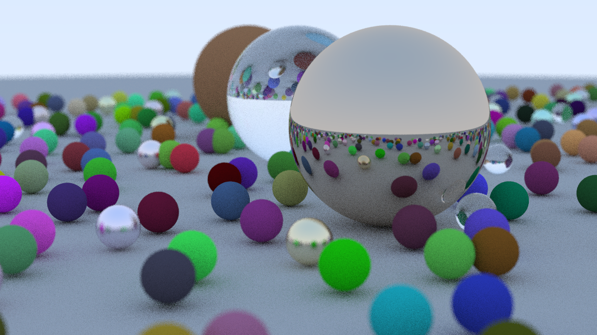

# ray-tracing-one-weekend-cpp

## Requirements

For compiling this project from source you will need the following

- CMake 3.15 or later
- C++20 Compiler

## Building

### Source

If you wish to build from source you will need CMake. First clone this repo and cd into it.

```shell
git clone git@github.com:siddiqua1/ray-tracing-one-weekend-cpp.git
cd ray-tracing-one-weekend-cpp
```

Then build the project using your preferred generator.

```shell
cmake -B build
cmake --build build
```

It recommended to build for release which you can do so with the following command

```shell
cmake --build build --config release
```

### Docker

To build using Docker first create the Docker image using the following command

```shell
docker build -t ray-tracing .
```

Then to run the container you need to ensure that the `output` directory from the docker image is mounted to some local directory so that outputted `.png` files can be viewed on your host machine.

```shell
mkdir -p $(pwd)/output
docker run -v $(pwd)/output:/app/output ray-tracing
```

If you are on windows, the corresponding commands are

```shell
mkdir %CD%\output
docker run -v %CD%/output:/app/output ray-tracing
```

## Cleaning

If you built from source you may want to clean your CMake fiels before rebuilding whihc you cna do with the following command.

```shell
cmake --build build --target clean
```

## Applications

The project builds multiple binaries corresponding to the various checkpoints in the series. The following is a render generated by the last checkpoint.



_Note:_ Generated files are in the `.ppm` format as they are easy to write to. You will need a likely need a converter to view locally. The Docker container uses `imagemagick`.

### Roadmap

- [x] Get first iteration from the book working
- [x] Update codebase to use more modern C++ and CMake features
- [x] Docker support
- [ ] Benchmarking framework
- [ ] Render modes
  - Toggle between file out put and live render
- [ ] Wasm build for live in browser render
- [ ] Optimize codebase (ECS?)

### References

[_Ray Tracing in One Weekend_](https://raytracing.github.io/books/RayTracingInOneWeekend.html)
